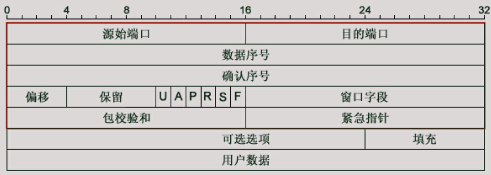

# 字节跳动三轮面试

## 从输入网址到页面显示的完整过程

1. DNS解析

- 浏览器将接收到的url中抽取出域名字段，就是访问的主机名，并将这个主机名传送给DNS应用的客户端
- DNS客户机端向DNS服务器端发送一份查询报文，报文中包含着要访问的主机名字段（中间包括一些列缓存查询以及分布式DNS集群的工作）**如果这一步做了智能 DNS 解析的话，会提供访问速度最快的 IP 地址回来**
- 该DNS客户机最终会收到一份回答报文，其中包含有该主机名对应的IP地址
- 一旦该浏览器收到来自DNS的IP地址，就可以向该IP地址定位的HTTP服务器发起TCP连接

2. TCP链接

-  接下来是 TCP 握手，应用层会下发数据给传输层，这里 TCP 协议会指明两端的端口号，然后下发给网络层。网络层中的 IP 协议会确定 IP 地址，并且指示了数据传输中如何跳转路由器。然后包会再被封装到数据链路层的数据帧结构中，最后就是物理层面的传输了
- TCP 握手结束后会进行 TLS 握手，然后就开始正式的传输数据

3. HTTP 请求/响应

- 数据在进入服务端之前，可能还会先经过负责负载均衡的服务器，它的作用就是将请求合理的分发到多台服务器上，这时假设服务端会响应一个 HTML 文件
- 首先浏览器会判断状态码是什么，如果是 200 那就继续解析，如果 400 或 500 的话就会报错，如果 300 的话会进行重定向，这里会有个重定向计数器，避免过多次的重定向，超过次数也会报错
- 浏览器开始解析文件，如果是 gzip 格式的话会先解压一下，然后通过文件的编码格式知道该如何去解码文件
- 文件解码成功后会正式开始渲染流程，先会根据 HTML 构建 DOM 树，有 CSS 的话会去构建 CSSOM 树。如果遇到 script 标签的话，会判断是否存在 async 或者 defer ，前者会并行进行下载并执行 JS，后者会先下载文件，然后等待 HTML 解析完成后顺序执行，如果以上都没有，就会阻塞住渲染流程直到 JS 执行完毕。遇到文件下载的会去下载文件，这里如果使用 HTTP 2.0 协议的话会极大的提高多图的下载效率。
- 初始的 HTML 被完全加载和解析后会触发 DOMContentLoaded 事件
- CSSOM 树和 DOM 树构建完成后会开始生成 Render 树，这一步就是确定页面元素的布局、样式等等诸多方面的东西
- 在生成 Render 树的过程中，浏览器就开始调用 GPU 绘制，合成图层，将内容显示在屏幕上了

## HTTP 请求头

### 常见请求头

- Accept: text/html,image/*      -- 浏览器接受的数据类型

- Accept-Charset: ISO-8859-1     -- 浏览器接受的编码格式

- Accept-Encoding: gzip,compress  --浏览器接受的数据压缩格式

- Accept-Language: en-us,zh-       --浏览器接受的语言

- Host          --（必须的）当前请求访问的目标地址（主机:端口）

- If-Modified-Since: Tue, 11 Jul 2000 18:23:51 GMT  --浏览器最后的缓存时间

- Referer      -- 当前请求来自于哪里

- User-Agent: Mozilla/4.0 (compatible; MSIE 5.5; Windows NT 5.0)  --浏览器类型

- Cookie:name=eric                     -- 浏览器保存的cookie信息

- Connection: close/Keep-Alive            -- 浏览器跟服务器连接状态。close: 连接关闭  keep-alive：保存连接。

- Date: Tue, 11 Jul 2000 18:23:51 GMT      -- 请求发出的时间
- Origin    --用于CORS跨域

### 常用响应头

- Location: http://www.it315.org/index.jsp   -表示重定向的地址，该头和302的状态码一起使用。

- Server:apache tomcat                 ---表示服务器的类型

- Content-Encoding: gzip                 -- 表示服务器发送给浏览器的数据压缩类型

- Content-Length: 80                    --表示服务器发送给浏览器的数据长度

- Content-Language: zh-cn               --表示服务器支持的语言

- Content-Type: text/html; charset=GB2312   --表示服务器发送给浏览器的数据类型及内容编码

- Last-Modified: Tue, 11 Jul 2000 18:23:51 GMT  --表示服务器资源的最后修改时间

- Refresh: 1;url=http://www.it315.org     --表示定时刷新

- Content-Disposition: attachment; filename=aaa.zip --表示告诉浏览器以下载方式打开资源（下载文件时用到）

- Transfer-Encoding: chunked

- Set-Cookie:SS=Q0=5Lb_nQ; path=/search   --表示服务器发送给浏览器的cookie信息（会话管理用到）

- Expires: -1                           --表示通知浏览器不进行缓存

- Cache-Control: no-cache

- Pragma: no-cache

- Connection: close/Keep-Alive           --表示服务器和浏览器的连接状态。close：关闭连接 keep-alive:保存连接
  

## TCP头部和UDP头部

### TCP

- 源端口号和目的端口号：再加上Ip首部的源IP地址和目的IP地址可以唯一确定一个TCP连接 
- 数据序号：表示在这个报文段中的第一个数据字节序号 
- 确认序号：仅当ACK标志为1时有效。确认号表示期望收到的下一个字节的序号（这个下面再详细分析） 
- 偏移：就是头部长度，有4位，跟IP头部一样，以4字节为单位。最大是60个字节 
- 保留位：6位，必须为0 
- 6个标志位： 
  - URG-紧急指针有效 
  - ACK-确认序号有效 
  - PSH-接收方应尽快将这个报文交给应用层 
  - RST-连接重置 
  - SYN-同步序号用来发起一个连接 
  - FIN-终止一个连接
- 窗口字段：16位，代表的是窗口的字节容量，也就是TCP的标准窗口最大为2^16 - 1 = 65535个字节（这个下面再详细分析）
- 校验和：源机器基于数据内容计算一个数值，收信息机要与源机器数值 结果完全一样，从而证明数据的有效性。检验和覆盖了整个的TCP报文段：这是一个强制性的字段，一定是由发送端计算和存储，并由接收端进行验证的。
- 紧急指针：是一个正偏移量，与序号字段中的值相加表示紧急数据最后一个字节的序号。TCP的紧急方式是发送端向另一端发送紧急数据的一种方式

### UDP

- source port: 源端口号，占16位，2个字节 
- dest port: 目的端口号，占16位，2个字节 
- length: 此字段标记了整个数据报（UDP的首部+UDP数据）的最大长度 
- checksum: 检验和，此字段用处是用来检查收到地数据的对错的 
  - ps：如果校验和出错，就会直接丢弃 

- Application data: 数据部分（如果有的话

## XSS和CSRF攻击与防范

## 伪元素的使用场景

## ES6 Proxy的使用

## WebPack打包原理

## session的工作原理 

## 回流和重绘是什么，带来的问题，解决方案

